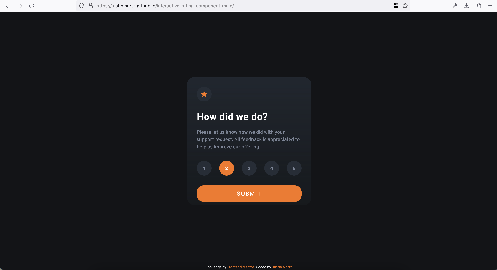
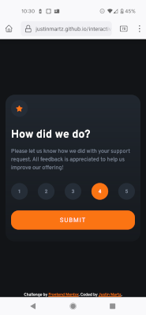
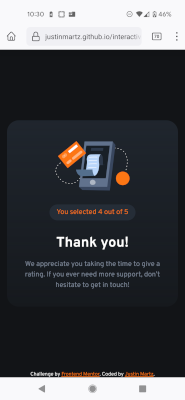

# Frontend Mentor - Interactive rating component solution

This is a solution to the [Interactive rating component challenge on Frontend Mentor](https://www.frontendmentor.io/challenges/interactive-rating-component-koxpeBUmI). Frontend Mentor challenges help you improve your coding skills by building realistic projects. 

## Table of contents

- [Overview](#overview)
  - [The challenge](#the-challenge)
  - [Screenshot](#screenshot)
  - [Links](#links)
- [My process](#my-process)
  - [Built with](#built-with)
  - [What I learned](#what-i-learned)
  - [Continued development](#continued-development)
  - [Useful resources](#useful-resources)
- [Author](#author)

## Overview

### The challenge

Users should be able to:

- View the optimal layout for the app depending on their device's screen size
- See hover states for all interactive elements on the page
- Select and submit a number rating
- See the "Thank you" card state after submitting a rating

### Screenshot

### Links

- Solution URL: [https://github.com/JustinMartz/interactive-rating-component-main](https://github.com/JustinMartz/interactive-rating-component-main)
- Live Site URL: [https://justinmartz.github.io/interactive-rating-component-main/](https://justinmartz.github.io/interactive-rating-component-main/)

## My process

### Built with

- Semantic HTML5 markup
- CSS custom properties
- Flexbox
- Mobile-first workflow
- JavaScript

### What I learned

I got a really good lesson on hsl() and where I can and can't use alpha values. I also learned that a:visited can't take a color with an alpha value.

I learned about :focus states and hope I used that appropriately in this solution.

I'm trying to improve my use of semantic HTML with every challenge so with this one I styled the cards as article elements and nested those within a section. I also put the Frontend Mentor attribution in a footer. UPDATE: W3 Nu Html Checker said if I'm going to use section then it needs a heading, and if it doesn't need a heading then to use a div. I'll do that for the next challenge. 

### Continued development

I'll continue to learn more about HTML, CSS, and JavaScript.

### Useful resources

- [Assigning IDs to buttons](https://stackoverflow.com/questions/51287162/how-to-have-multiple-buttons-of-same-id-value-and-when-click-on-any-button-the-p) - Stack Overflow question about assigning IDs to buttons that helped me.
- [How to replace div content after click](https://stackoverflow.com/questions/25735512/replace-div-content-onclick) - Stack Overflow question with a few different answers about how to do this. One answer illuminated for me the idea of adding and removing a "show" or "hide" class to the div, which is just a class with 'display: none' inside of it. 
- [JavaScript to make a div visible after being hidden](https://stackoverflow.com/questions/38051092/how-to-make-visible-a-div-which-is-initially-hidden-by-clicking-on-button-using) - Answers in this Stack Overflow question are the base for the script I wrote.
- [Using data attributes](https://developer.mozilla.org/en-US/docs/Learn/HTML/Howto/Use_data_attributes) - Mozilla Developer Network page on using data attributes in HTML and how to access them in JavaScript. This is the route I took for assigning values to each rating button.

## Author

- Website - [Justin Martz on GitHub Pages](https://justinmartz.github.io)
- Frontend Mentor - [@JustinMartz](https://www.frontendmentor.io/profile/JustinMartz)